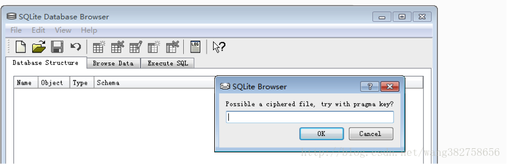
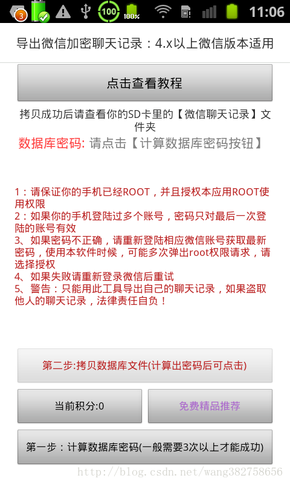
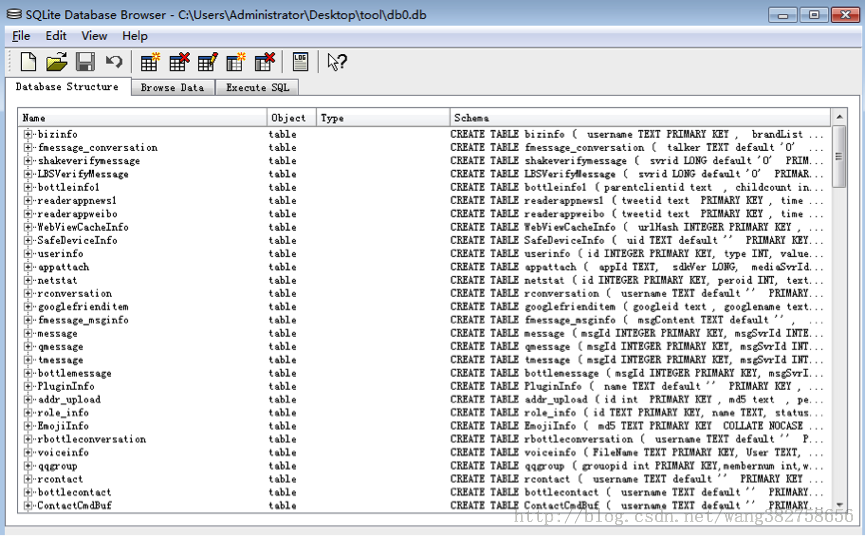
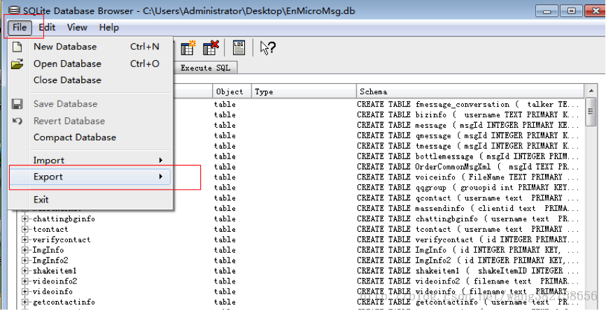

## 破解微信EnMicroMsg.db导出加密聊天聊天记录
[原文地址](http://www.xuebuyuan.com/2155669.html)

另一个教程[地址](README1.MD)

微信加密聊天记录EnMicroMsg.db导出步骤

### 一、前提：

你的手机已经root，且安装了微信加密聊天记录导出助手软件：

微信加密聊天记录导出助手[下载地址](http://download.csdn.net/detail/wang382758656/7000933)

**Ps**：使用过程中请允许ROOT权限，一次不成功，可以重新登录微信，重试多次，导出助手计算的密码对于最后登录的微信账号有效，所以如果你想查看其他的账号的记录，请登录相应账号，重新计算密码即可。

                                警告:请勿导出他人聊天记录，否则引起的法律责任自负！

### 二、操作

打开“微信加密聊天记录导出助手”的点击计算数据库密码，正常情况下可以顺利计算出密码，再点击拷贝数据库到Sd卡按钮，把聊天记录文件拷贝到SD卡，

三、取出SD卡或者用91手机助手，或者360手机助手的“文件管理器”打开手机的SD卡

 你会发现SD根目录有一个叫做”微信聊天记录”的文件夹，里面会有几个文件，请导出到电脑上，

一般至少会有至少一个db 文件，这个就是你的聊天记录，和一个tool.zip包(这个是数据查看工具)，解压zip包，你会发现一个sqlcipher.exe绿色小软件，

请把db文件拖放到sqlcipher.exe上打开文件，此时会提示你输入密码：

请输入“导出助手”计算出来的密码，如果密码不正确，请拖放别的db文件到sqlcihper上打开，如果有多个db文件，几个db文件计算的加密码是不一样的，每次计算的密码只能打开一个db文件，打不开的db文件，可能是其他的微信账号的聊天记录，需要登录对应的微信账号，然后重新计算密码，如果密码正确情况如下，这就是整个数据库

点击File 菜单下Export选项，导出message表

在弹出的表里面选择Table name为message，选择导出文件格式csv,

用excell打开该文件找到 content字段，就是你的聊天记录，talker就是对方微信账号

