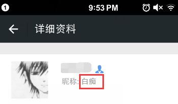
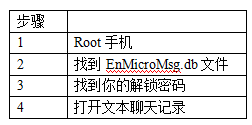
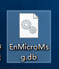
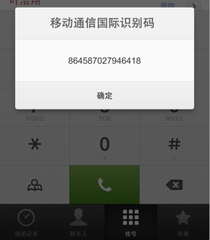
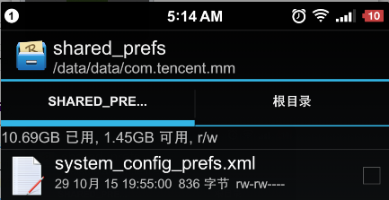
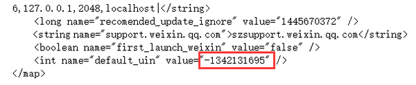
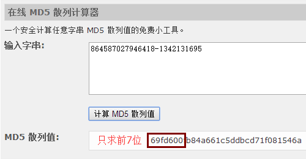
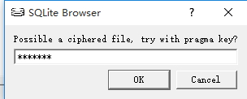
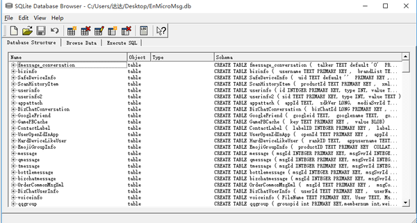
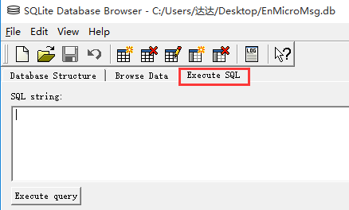

[原文地址](https://www.zhihu.com/question/19924224)

另一个[教程](README.MD)

下文是拆解微信数据库的干货！

效果如下

### 1.如果手机已经root了,用Root Explorer把文件拷贝出来

路径：/data/data/com.tencent.mm/MicroMsg/一大串长文件夹/EnMicroMsg.db

这文件存放着微信聊天记录，把它拷贝到根目录，接着拷贝到电脑桌面

### 2.文件是加密的，找到你的解锁钥匙

钥匙 KEY = IMEI （手机序列号） + UIN（用户信息号）

手机输入 *#06# 能得到IMEI

在哪里找到UIN呢？

文件路径：/data/data/com.tencent.mm/shared_prefs/system_config_prefs.xml

拷贝到电脑，右键记事本打开，uin在最下面

钥匙 KEY= IMEI （手机序列号） + UIN（用户信息号）= 864587027946418-1342131695 

把这一层拷贝到网站计算MD5值， 网站地址：[免费 MD5 散列计算器](https://link.zhihu.com/?target=http%3A//md5calculator.chromefans.org/%3Flangid%3Dzh-cn)

把前7位拷贝下来当做钥匙KEY：69fd600

### 3.下载打开数据库的软件SQLite Database Browser

感谢网友把解密功能嵌套进去，下载地址：[百度云](https://link.zhihu.com/?target=http%3A//pan.baidu.com/s/1dDBa4FZ)，打开如下

点击File，OpenDatabase，选择刚才的EnMicroMsg.db文件

弹出一个框，输入刚才7位的钥匙，就能顺利打开了微信数据库了

打开效果如下

4.查询与某人的聊天记录，点击窗口：Execute SQL

贴下面这一串SQL语句上去，点击Execute query即可

	select datetime(subStr(cast(m.createTime as text),1,10),'unixepoch', 'localtime') as theTime,
	case m.isSend when 0 then r.nickname when 1 then '我'end as person,
	m.content 
	from message m inner join rcontact r 
	on m.talker = r.username 
	where m.type=1 and r.nickname = '对方微信昵称'

查询你和不同人的对话记录，就替换对方的微信昵称

